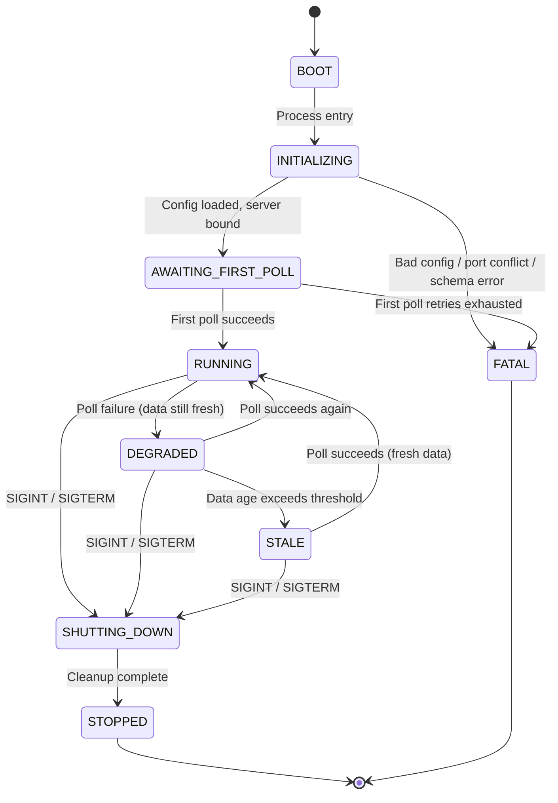
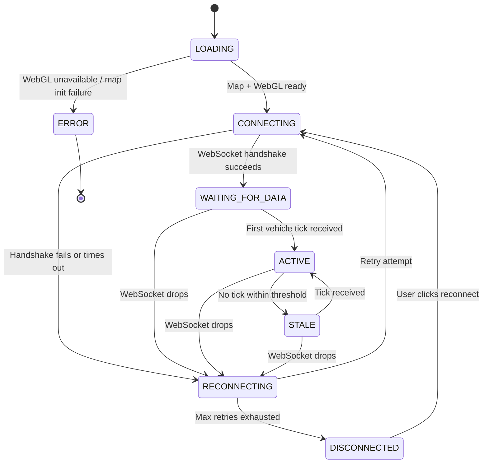

# State Transitions

Two independent state machines — one for the server process, one for each client session. They're coupled by a WebSocket connection but have their own lifecycles.

---

## Server States

| State | Meaning |
|---|---|
| `BOOT` | Process has started. Nothing is loaded. |
| `INITIALIZING` | Loading config, parsing protobuf schema, binding the HTTP/WebSocket server. |
| `AWAITING_FIRST_POLL` | Server is listening. First GTFS-RT fetch (all 10 feeds in parallel) is in flight. No vehicle data exists yet — nothing to broadcast. |
| `RUNNING` | Happy path. Has vehicle data, polling every 30s, interpolating positions, broadcasting ticks to clients. |
| `DEGRADED` | One or more feed polls failing, but the most recent data is still fresh enough to interpolate from. Partial failures are possible — some modes may update while others don't. Clients are served with a staleness warning. |
| `STALE` | Data age has exceeded the staleness threshold (recommended: 120s — based on observed per-vehicle timestamp ages of up to 15 minutes). Broadcasts continue but are flagged as unreliable. |
| `SHUTTING_DOWN` | Graceful shutdown in progress. Closing connections, clearing timers. |
| `STOPPED` | **Terminal.** Process has exited cleanly. |
| `FATAL` | **Terminal.** Unrecoverable error — bad config, port conflict, proto schema failure, missing `OPENDATA_VIC_API_KEY`, or first poll exhausted all retries. |

## Server Transition Diagram



## Server Transitions Table

| From | To | Trigger | Actor |
|---|---|---|---|
| `BOOT` | `INITIALIZING` | Process entry point reached | System |
| `INITIALIZING` | `AWAITING_FIRST_POLL` | Config validated, proto schema parsed, server bound to port | System |
| `INITIALIZING` | `FATAL` | Missing `OPENDATA_VIC_API_KEY`, port in use, protobuf schema parse failure | System |
| `AWAITING_FIRST_POLL` | `RUNNING` | At least one of the 10 feed fetches returns valid data (vehicle positions are the minimum requirement) | External (GTFS-RT feed) |
| `AWAITING_FIRST_POLL` | `FATAL` | All 4 vehicle position feeds fail after retry attempts (API key rejected, network unreachable). Trip update / service alert failures alone don't block startup. | External (GTFS-RT feed) |
| `RUNNING` | `DEGRADED` | One or more feed polls fail (partial: e.g. bus positions 503 but tram/train still updating, or all trip updates fail but positions still work) or all fail but data age < staleness threshold | External (GTFS-RT feed) |
| `RUNNING` | `SHUTTING_DOWN` | Process receives SIGINT or SIGTERM | User / System |
| `DEGRADED` | `RUNNING` | A subsequent poll succeeds, new data replaces the stale snapshot | External (GTFS-RT feed) |
| `DEGRADED` | `STALE` | Time since last successful poll exceeds staleness threshold (~120s — see [gtfs-vic.md](gtfs-vic.md) timestamp freshness data) | System (timer) |
| `DEGRADED` | `SHUTTING_DOWN` | Process receives SIGINT or SIGTERM | User / System |
| `STALE` | `RUNNING` | A poll finally succeeds with fresh data | External (GTFS-RT feed) |
| `STALE` | `SHUTTING_DOWN` | Process receives SIGINT or SIGTERM | User / System |
| `SHUTTING_DOWN` | `STOPPED` | All WebSocket connections closed, all timers cleared | System |

## Invalid Server Transitions

| Attempted | Reason |
|---|---|
| `STOPPED` → anything | Terminal state. Process is gone. |
| `FATAL` → anything | Terminal state. Requires operator intervention and a restart. |
| `BOOT` → `RUNNING` | Must initialize and complete first poll. No shortcuts. |
| `BOOT` → `AWAITING_FIRST_POLL` | Must pass through `INITIALIZING` first. |
| `AWAITING_FIRST_POLL` → `DEGRADED` | Never had data — can't degrade from nothing. |
| `AWAITING_FIRST_POLL` → `STALE` | Never had data — can't go stale if nothing was ever fresh. |
| `RUNNING` → `AWAITING_FIRST_POLL` | Can't un-have data. |
| `RUNNING` → `STALE` | Must pass through `DEGRADED` first. Staleness is progressive. |
| `SHUTTING_DOWN` → `RUNNING` | Shutdown is irreversible. |

---

## Client States

| State | Meaning |
|---|---|
| `LOADING` | Page opened. Map tiles and WebGL context are initializing. |
| `CONNECTING` | Map is ready. Attempting WebSocket handshake with the server. |
| `WAITING_FOR_DATA` | WebSocket connected. No vehicle data received yet (server may still be in `AWAITING_FIRST_POLL`). |
| `ACTIVE` | Happy path. Receiving ticks, rendering vehicles, smooth animation. |
| `STALE` | Connected but no tick received within the expected window. Data on screen is aging. |
| `RECONNECTING` | WebSocket dropped. Retrying with backoff. Last-known data stays on screen but freezes. |
| `DISCONNECTED` | Reconnection retries exhausted. Frozen. User must act. |
| `ERROR` | **Terminal.** Unrecoverable failure — WebGL not supported, map tiles unreachable, etc. |

## Client Transition Diagram



## Client Transitions Table

| From | To | Trigger | Actor |
|---|---|---|---|
| `LOADING` | `CONNECTING` | Mapbox GL + deck.gl + WebGL initialized successfully | System |
| `LOADING` | `ERROR` | WebGL context creation fails, or map tiles unreachable | System / External |
| `CONNECTING` | `WAITING_FOR_DATA` | WebSocket `open` event fires | System |
| `CONNECTING` | `RECONNECTING` | WebSocket `error` or handshake timeout | External (network) |
| `WAITING_FOR_DATA` | `ACTIVE` | First message with vehicle positions decoded | External (server) |
| `WAITING_FOR_DATA` | `RECONNECTING` | WebSocket `close` event before any data arrives | External (network) |
| `ACTIVE` | `STALE` | No tick received for longer than the stale threshold (e.g. 5s) | System (timer) |
| `ACTIVE` | `RECONNECTING` | WebSocket `close` or `error` event | External (network) |
| `STALE` | `ACTIVE` | A tick arrives (possibly after server recovered) | External (server) |
| `STALE` | `RECONNECTING` | WebSocket drops entirely | External (network) |
| `RECONNECTING` | `CONNECTING` | Backoff timer fires, new WebSocket attempt begins | System |
| `RECONNECTING` | `DISCONNECTED` | Retry count exceeds maximum | System |
| `DISCONNECTED` | `CONNECTING` | User clicks a reconnect button or refreshes | User |

## Invalid Client Transitions

| Attempted | Reason |
|---|---|
| `ERROR` → anything | Terminal. Page must be reloaded — this is a new session, not a transition. |
| `LOADING` → `ACTIVE` | Must connect and receive data first. No skipping steps. |
| `LOADING` → `WAITING_FOR_DATA` | Must establish WebSocket before waiting on it. |
| `ACTIVE` → `LOADING` | Can't re-initialize the map mid-session. |
| `ACTIVE` → `CONNECTING` | Must pass through `RECONNECTING`. Connection loss isn't instant recovery. |
| `DISCONNECTED` → `ACTIVE` | Must re-establish WebSocket and receive data first. |
| `RECONNECTING` → `ACTIVE` | Must pass through `CONNECTING` → `WAITING_FOR_DATA` first. |
| `WAITING_FOR_DATA` → `STALE` | Never had data — can't be stale before being active. |

---

## Transition Log Format

Every state change — successful or rejected — produces a structured log entry.

### Successful transition

```json
{
  "timestamp": "2026-03-22T14:30:01.123Z",
  "machine": "server",
  "previous": "RUNNING",
  "new": "DEGRADED",
  "trigger": "GTFS-RT poll returned HTTP 503",
  "actor": "external"
}
```

### Rejected transition

```json
{
  "timestamp": "2026-03-22T14:30:01.456Z",
  "machine": "client",
  "previous": "LOADING",
  "attempted": "ACTIVE",
  "rejected": true,
  "reason": "Cannot transition to ACTIVE from LOADING — must connect and receive data first",
  "trigger": "Premature data handler invocation",
  "actor": "system"
}
```

### Fields

| Field | Type | Description |
|---|---|---|
| `timestamp` | ISO 8601 string | When the transition occurred or was rejected. |
| `machine` | `"server"` or `"client"` | Which state machine. |
| `previous` | string | State before the transition. |
| `new` | string | State after the transition. Present only on success. |
| `attempted` | string | State that was requested. Present only on rejection. |
| `rejected` | boolean | `true` if the transition was denied. Absent on success. |
| `reason` | string | Why the transition was rejected. Absent on success. |
| `trigger` | string | What caused the transition attempt. |
| `actor` | `"user"` / `"system"` / `"external"` | Who or what initiated it. |

### Actor definitions

| Actor | Meaning |
|---|---|
| `user` | A human action — clicking reconnect, sending SIGINT, refreshing the page. |
| `system` | Internal logic — timers, initialization sequences, retry counters. |
| `external` | Something outside our control — the GTFS-RT feed, the network, the browser's WebGL support. |

---

## Terminal States

| Machine | State | Recovery |
|---|---|---|
| Server | `STOPPED` | None. Clean exit. Restart the process. |
| Server | `FATAL` | None. Fix the root cause (config, port, feed), then restart. |
| Client | `ERROR` | None. Reload the page (which starts a fresh session). |

`DISCONNECTED` on the client is **not** terminal — the user can manually trigger a reconnect. It's a dead end only if the user walks away.

---

## Real-World Timing Constants

Derived from live feed analysis (see [gtfs-vic.md](gtfs-vic.md)):

| Constant | Value | Source |
|---|---|---|
| Feed poll interval | 7s | Aggressive polling to catch changes fast. Feed caches ~30s server-side, so most polls return identical data. |
| Per-vehicle stale threshold | 120s | Vehicles older than this are likely parked — skip interpolation |
| Client tick broadcast interval | ~1s | Target for smooth animation |
| Client stale threshold | 5s | No tick received → show stale warning |
| Reconnect max retries | 5 | With exponential backoff |
| DEGRADED → STALE threshold | 120s | Time since last successful vehicle position poll |
| Rate limit budget | 20 req / 30s per endpoint | From `x-rate-limit` response header |
| Total feeds per poll | 10 | 4 vehicle positions + 4 trip updates + 2 service alerts |
| Total bandwidth per poll | ~558 KB | All 10 feeds combined |
