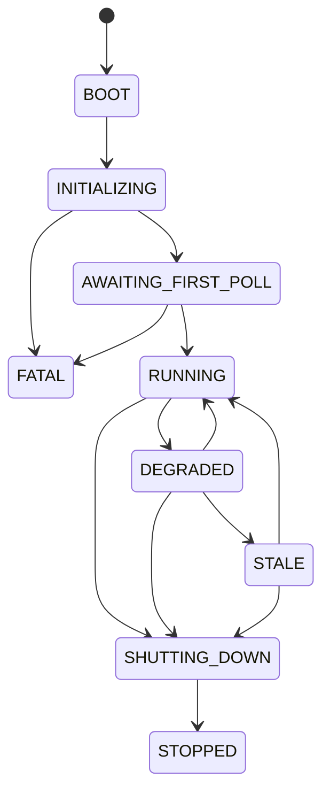
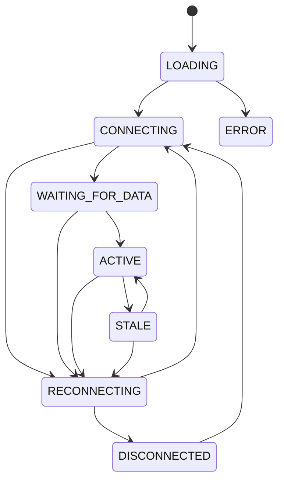

# State Transitions

Two state machines. Server and client. Independent lifecycles, coupled by WebSocket.

---

## Server



| State | What's happening |
|---|---|
| `BOOT` | Process started. Nothing loaded. |
| `INITIALIZING` | Loading config, proto schema, shapes (non-fatal if shapes fail), binding server. |
| `AWAITING_FIRST_POLL` | Listening. First feed fetch in flight. No data yet. |
| `RUNNING` | Happy path. Polling, interpolating, broadcasting. |
| `DEGRADED` | Some feeds failing but data is still fresh enough to use. |
| `STALE` | Data older than 120s. Still broadcasting but flagged unreliable. |
| `SHUTTING_DOWN` | SIGINT/SIGTERM received. Closing connections. |
| `STOPPED` | Terminal. Clean exit. |
| `FATAL` | Terminal. Bad config, port conflict, or first poll failed after retries. |

**Key rules:**
- Startup requires at least one vehicle position feed to succeed. Trip update / alert failures don't block boot.
- GTFS Schedule download failure is not fatal — falls back to straight-line interpolation.
- `RUNNING` can't jump to `STALE` — must pass through `DEGRADED` first.
- `STOPPED` and `FATAL` are terminal. Nothing comes after.

---

## Client



| State | What's happening |
|---|---|
| `LOADING` | Map + WebGL initializing. |
| `CONNECTING` | WebSocket handshake in progress. |
| `WAITING_FOR_DATA` | Connected. No vehicle data yet. |
| `ACTIVE` | Happy path. Receiving ticks, rendering vehicles. |
| `STALE` | Connected but no tick for 5s. Data on screen is aging. |
| `RECONNECTING` | WebSocket dropped. Retrying with exponential backoff. |
| `DISCONNECTED` | Max retries exhausted. User must click reconnect. |
| `ERROR` | Terminal. WebGL failed or map can't load. Reload the page. |

**Key rules:**
- `STALE` means the connection is alive but no data is arriving (server issue). Different from `RECONNECTING` (connection lost).
- `DISCONNECTED` is not terminal — user can manually reconnect.
- `ERROR` is terminal — requires page reload.

---

## Transition log format

Every transition (accepted or rejected) logs:

```json
{"timestamp":"...","machine":"server","previous":"RUNNING","new":"DEGRADED","trigger":"bus feed 503","actor":"external"}
```

Rejected transitions include `"rejected": true` and `"reason": "..."` instead of `"new"`.

Actors: `user` (human action), `system` (internal logic), `external` (feed, network, browser).

---

## Timing constants

| Constant | Value |
|---|---|
| Poll interval | 15s |
| Broadcast interval | ~1s |
| Stale vehicle threshold | 120s |
| Client stale threshold | 5s |
| Reconnect max retries | 5 |
| DEGRADED → STALE | 120s without a successful position poll |
| Rate limit | ~20 req / 30s per endpoint |
