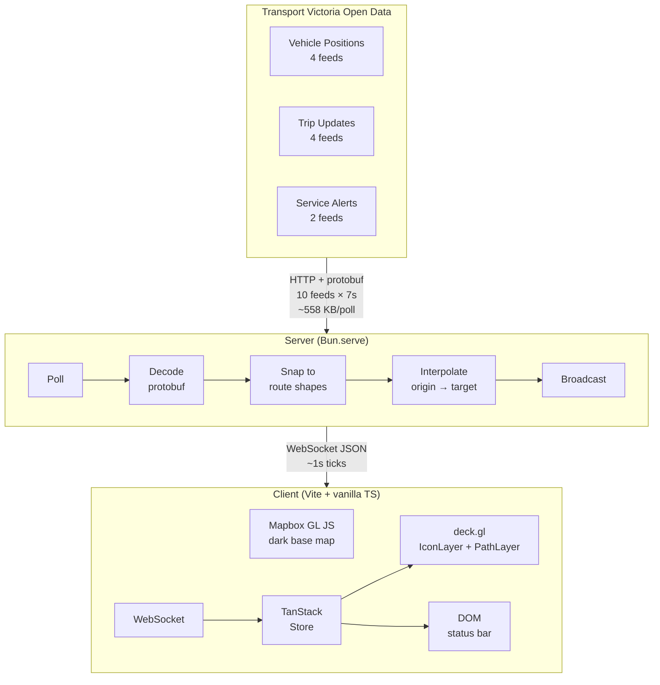

# Architecture

## High-level view

## Server

### Responsibilities

1. **Poll** 10 GTFS-RT feeds every 7 seconds in parallel
2. **Decode** Protocol Buffer responses into typed vehicle positions, trip updates, and service alerts
3. **Snap** each vehicle onto its GTFS route shape polyline (`trip_id` → `shape_id`). Calculate speed from distance traveled along the shape.
4. **Interpolate** between polls: traverse from previous position (origin) to new position (target) along the shape, then project forward. No teleporting, no building-cutting.
5. **Broadcast** the interpolated world state to all connected WebSocket clients every ~1 second

### State machine

See [State Transitions](/data-flow#server-state-machine) for the full diagram.

The server is authoritative — clients render exactly what the server sends. This ensures multiple browser windows show vehicles in the same location.

### Key design decisions

- **No database — for now.** Vehicle state is ephemeral in-memory. The architecture preserves seams for a future [time machine feature](/data-flow#future-time-machine): server writes daily Parquet snapshot files, client queries them with DuckDB-WASM for historical playback.
- **No REST API.** All client communication is one-way WebSocket broadcast.
- **Route-snapped interpolation.** Vehicles follow their GTFS route shape polyline — actual road/track/tram line geometry. No cutting through buildings. Falls back to straight-line for unmatched vehicles.
- **GTFS Schedule shapes loaded at boot.** The static GTFS ZIP (~191 MB) is downloaded once, cached, and shapes + trips are extracted to build an in-memory `trip_id → shape polyline` index.
- **Stale vehicle detection.** Vehicles with per-entity timestamps >120s old are held at their last position, not projected forward.
- **Partial failure tolerance.** If some feeds fail but at least one vehicle position feed succeeds, the server continues in DEGRADED state.

## Client

### Responsibilities

1. **Render** the Mapbox base map with a deck.gl overlay
2. **Receive** world state ticks over WebSocket
3. **Update** the vehicle layer via TanStack Store subscription
4. **Display** connection status and vehicle counts

### Stack

| Layer | Technology |
|---|---|
| Build | Vite |
| State | TanStack Store |
| Map tiles | Mapbox GL JS (dark-v11) |
| Data rendering | deck.gl IconLayer (arrows) + PathLayer (trails) |
| UI | Vanilla DOM |

No React or any UI framework. The store subscription drives both the deck.gl layer updates and the status bar DOM mutations directly.

### Vehicle rendering

- Each vehicle is a **directional arrow** that points in its direction of travel
- **Colors by mode**: blue (metro train), green (tram), orange (bus), purple (V/Line)
- Stale vehicles are dimmed gray
- Arrow size scales by mode — trains largest, buses smallest
- A **snail trail** (fading path) follows each moving vehicle, showing its recent trajectory
- Trails are drawn as `PathLayer` underneath the arrows, using matching mode colors at reduced opacity
- Arrow rotation and position both use deck.gl's built-in `transitions` for smooth animation between 1-second server ticks
