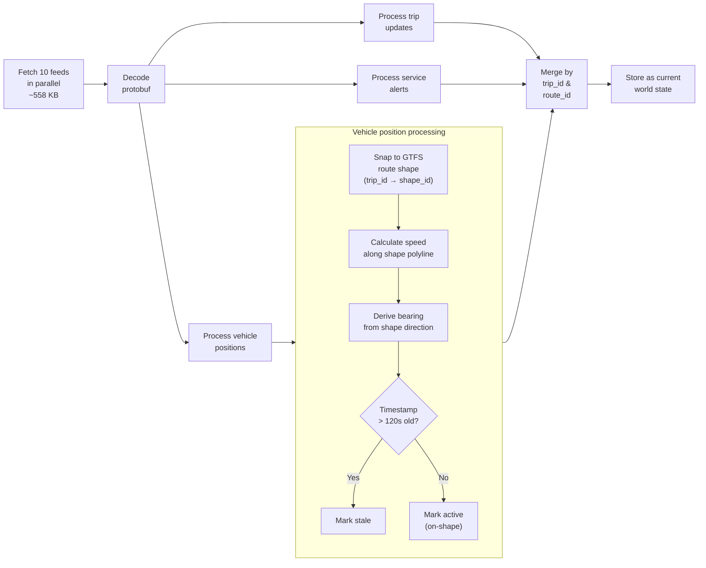
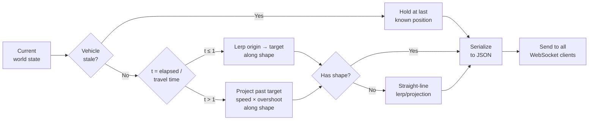
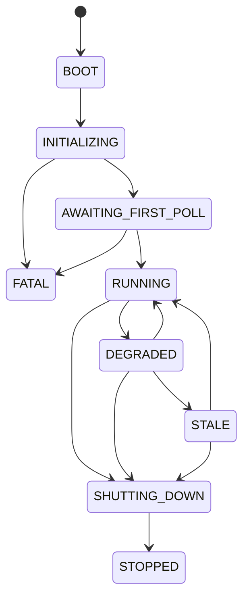
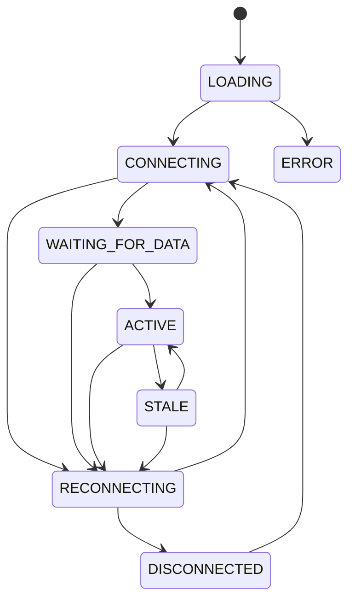
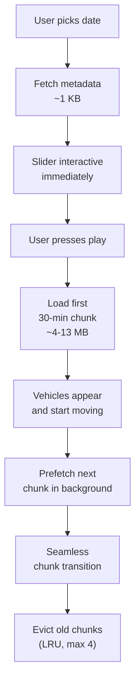
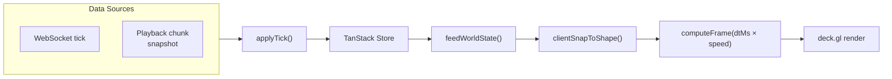

# Data Flow

## Feed inventory

10 GTFS Realtime feeds from Transport Victoria:

| Mode | Vehicle Positions | Trip Updates | Service Alerts |
|---|---|---|---|
| Metro Train | ✓ ~90 vehicles | ✓ ~143 trips | ✓ ~41 alerts |
| Tram | ✓ ~160 vehicles | ✓ ~361 trips | ✓ ~4 alerts |
| Bus | ✓ ~1,700 vehicles | ✓ ~651 trips | ✗ |
| V/Line | ✓ ~30 vehicles | ✓ ~45 trips | ✗ |

All feeds use Protocol Buffer encoding and the `KeyID` header for authentication.

## Poll cycle (every 15 seconds)

## Broadcast cycle (every ~1 second)

## Server state machine

## Client state machine

## Time machine — YouTube-style streaming playback

DuckDB on both sides. Server records raw feed data, client streams 30-minute chunks on demand.

### Server endpoints

| Endpoint | Purpose | Response |
|---|---|---|
| `GET /data/snapshots` | List available dates | JSON array of date strings |
| `GET /data/snapshots/:date/meta` | Day metadata (instant) | `{ minTimestamp, maxTimestamp, snapshotCount, hours }` |
| `GET /data/snapshots/:date?from=&to=` | 30-min Parquet chunk | ~4–13 MB binary (cached on disk) |
| `GET /data/snapshots/:date` | Full day Parquet (legacy) | ~150–200 MB binary |

**Recording:** Before `processSnapshot()`, batch-inserts raw GTFS-RT data into DuckDB (`.data/snapshots/YYYY-MM-DD.duckdb`, Melbourne time).

### Client streaming flow

The chunk manager (`playback-chunks.ts`) tracks loaded ranges, handles fetch + DuckDB-WASM decode, and evicts old chunks. A buffer bar on the slider shows loaded ranges. Seeking to unloaded time shows a brief inline "Buffering..." indicator, not a full-screen modal.

### Single animation pipeline

One render loop. One speed multiplier. Zero duplicate animation code.

Live animation rule: each authoritative `WorldState` appends at most one constant-velocity motion segment per vehicle. Segment duration comes from `WorldState.tickTimeMs` on the shared world clock, not the semantic `VehiclePosition.speed` field. Backlog bootstrap replays the same segment model, so startup and steady-state live mode use the same motion contract.

## Key timing constants

| Constant | Value |
|---|---|
| Feed poll interval | 15s |
| Broadcast interval | ~1s |
| Stale vehicle threshold | 120s |
| Client stale threshold | 5s |
| Reconnect max retries | 5 |
| Reconnect backoff | exponential (1s base) |
