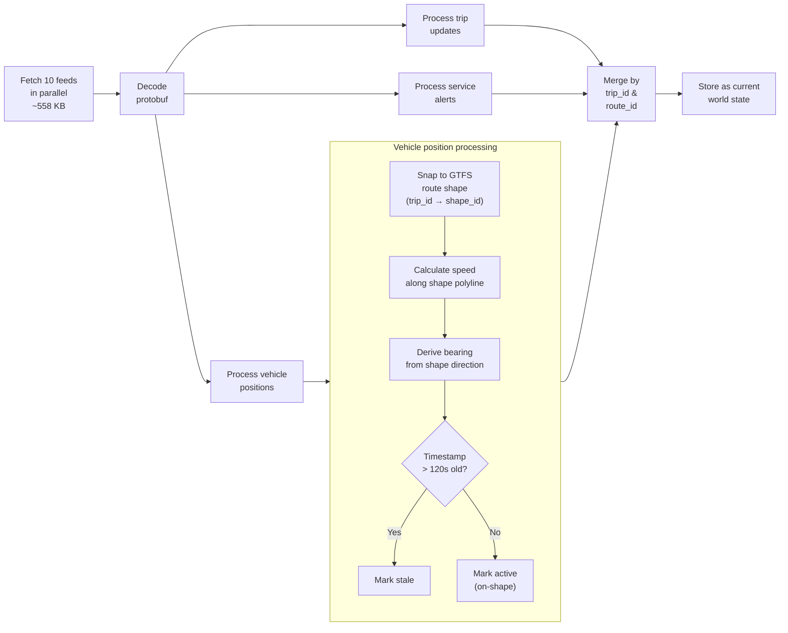
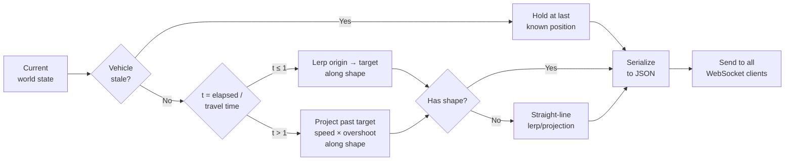
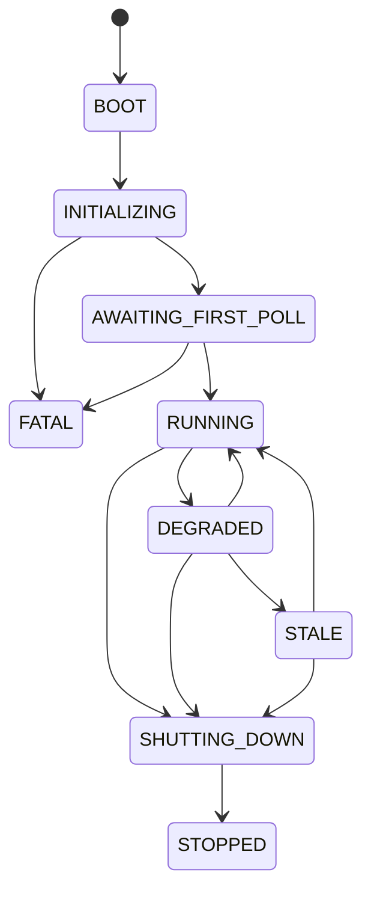
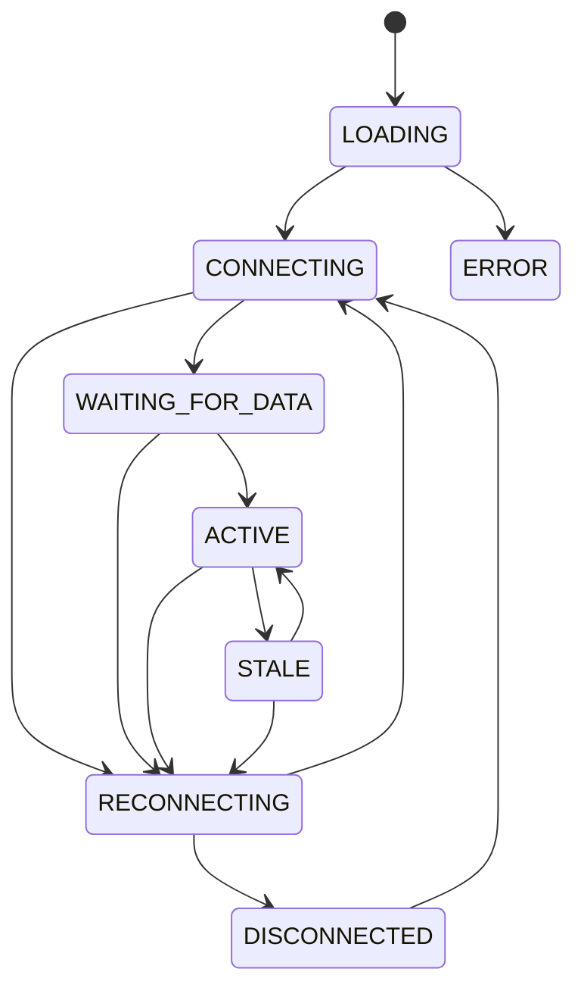
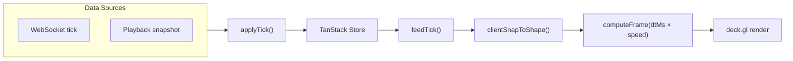

# Data Flow

## Feed inventory

10 GTFS Realtime feeds from Transport Victoria:

| Mode | Vehicle Positions | Trip Updates | Service Alerts |
|---|---|---|---|
| Metro Train | ✓ ~90 vehicles | ✓ ~143 trips | ✓ ~41 alerts |
| Tram | ✓ ~160 vehicles | ✓ ~361 trips | ✓ ~4 alerts |
| Bus | ✓ ~1,700 vehicles | ✓ ~651 trips | ✗ |
| V/Line | ✓ ~30 vehicles | ✓ ~45 trips | ✗ |

All feeds use Protocol Buffer encoding and the `KeyID` header for authentication.

## Poll cycle (every 7 seconds)

## Broadcast cycle (every ~1 second)

## Server state machine

## Client state machine

## Time machine (implemented)

DuckDB on both sides. Server records raw feed data, client plays it back.

**Server:** Before `processSnapshot()`, batch-inserts raw GTFS-RT data into DuckDB (`.data/snapshots/YYYY-MM-DD.duckdb`, Melbourne time). `GET /data/snapshots/:date` exports to Parquet.

**Client:** DuckDB-WASM loads the Parquet file into memory. All snapshots parsed into a sorted array. During playback, `advancePlayback()` feeds snapshots into `applyTick()` as the timestamp crosses them. `clientSnapToShape()` snaps raw GPS positions to cached route shapes. The same `feedTick` → `computeFrame` pipeline handles animation, trails, and bearing — identical to live mode.

**Single animation pipeline:**

One render loop. One speed multiplier. Zero duplicate animation code.

## Key timing constants

| Constant | Value |
|---|---|
| Feed poll interval | 7s |
| Broadcast interval | ~1s |
| Stale vehicle threshold | 120s |
| Client stale threshold | 5s |
| Reconnect max retries | 5 |
| Reconnect backoff | exponential (1s base) |
